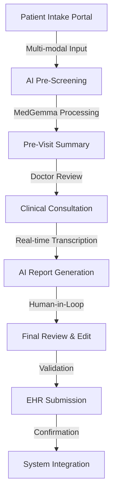

I'll examine the Google Appoint Ready demo to enhance our PRD with real-world insights. Let me fetch the details from both sources.# Enhanced Product Requirements Document (PRD)
## MedAssist AI - EHR Demo System v2.0
*Incorporating Google MedGemma Best Practices*

### 1. Executive Summary

**Product Name:** MedAssist AI Pro - Clinical Workflow Demo  
**Version:** 2.0 (Enhanced Demo)  
**Purpose:** Demonstrate an AI-powered EHR system inspired by Google's MedGemma approach for pre-visit information collection and clinical documentation  
**Tech Stack:** 
- **Frontend:** Streamlit (Python)
- **AI Models:** Google Gemini API (emulating MedGemma 4B/27B capabilities)
- **Audio:** streamlit-webrtc, audio-recorder-streamlit
- **Medical Standards:** FHIR compatibility, ICD-10-CM database
- **Deployment:** Docker-ready for Hugging Face Spaces

**Target Metrics:**
- Pre-visit documentation time: <3 minutes
- Consultation transcription accuracy: >95%
- ICD-10 coding accuracy: >90%
- Report generation time: <10 seconds

---

### 2. Product Architecture Overview

#### 2.1 System Flow


#### 2.2 MedGemma-Inspired Architecture
```python
# Core Components Based on Google's Approach
components = {
    "medical_vision": "Process medical images (X-rays, dermatology, pathology)",
    "medical_text": "Comprehend clinical notes and literature",
    "ehr_integration": "FHIR-based data exchange",
    "safety_layer": "Clinical validation and disclaimers",
    "multimodal_reasoning": "Combined text-image analysis"
}
```

---

### 3. Feature Specifications

## **Stage 1: Smart Patient Intake Portal**

### 3.1.1 Enhanced Patient Registration
```python
# Intelligent Patient Profiling
patient_profile = {
    # Basic Demographics
    "mrn": "Auto-generated Medical Record Number",
    "name": "Full legal name with preferred name option",
    "dob": "Date picker with age calculation",
    "gender": "Expanded options (M/F/Non-binary/Prefer not to say)",
    "contact": {
        "phone": "With SMS consent checkbox",
        "email": "With portal access setup",
        "emergency": "Secondary contact details"
    },
    
    # Clinical Context
    "visit_type": "New Patient/Follow-up/Urgent Care/Routine",
    "referring_physician": "Searchable dropdown",
    "insurance": "Auto-verify eligibility (mock)",
    "pharmacy": "Preferred pharmacy selection"
}
```

### 3.1.2 Multi-Modal Symptom Collection
```python
# MedGemma-Style Input Processing

class MultiModalIntake:
    def __init__(self):
        self.modalities = {
            "text": TextProcessor(),
            "audio": AudioTranscriber(),
            "image": MedicalImageAnalyzer(),
            "document": DocumentExtractor()
        }
    
    # Text Input with Medical NLP
    def process_text(self):
        # Symptom extraction with medical entity recognition
        # Temporal information parsing (onset, duration)
        # Severity scoring (1-10 scale)
        # Red flag symptom detection
        pass
    
    # Audio Processing
    def process_audio(self):
        # Real-time transcription
        # Speaker diarization (patient vs companion)
        # Emotion detection for pain assessment
        # Multi-language support
        pass
    
    # Image Analysis (MedGemma Vision)
    def process_image(self):
        # Skin lesion analysis
        # Wound assessment
        # Medication photo extraction
        # Previous report OCR
        pass
```

### 3.1.3 Intelligent Symptom Questionnaire
```python
# Dynamic Question Generation
symptom_questionnaire = {
    "chief_complaint": {
        "primary": "What brings you in today?",
        "duration": "When did this start?",
        "severity": "Rate your discomfort (1-10)",
        "quality": "Describe the sensation"
    },
    
    "review_of_systems": {
        # Dynamically generated based on chief complaint
        "constitutional": ["Fever", "Chills", "Weight loss"],
        "cardiovascular": ["Chest pain", "Palpitations"],
        "respiratory": ["Shortness of breath", "Cough"],
        # ... additional systems
    },
    
    "risk_assessment": {
        "covid_screen": "Recent exposure or symptoms?",
        "travel_history": "Recent travel (last 30 days)?",
        "allergies": "Medication/food/environmental allergies"
    }
}
```

### 3.1.4 Pre-Visit Document Upload
```python
# Document Intelligence
supported_documents = {
    "lab_results": ["PDF", "JPG", "DICOM"],
    "imaging": ["X-ray", "CT", "MRI"],
    "previous_records": ["Clinical notes", "Discharge summaries"],
    "insurance_cards": ["Front and back images"]
}

# Automatic extraction and structuring
document_processor = DocumentIntelligence(
    ocr_engine="Google Document AI",
    medical_nlp="MedGemma-style extraction",
    fhir_converter="HL7 FHIR R4"
)
```

---

## **Stage 2: AI-Powered Pre-Screening Report**

### 3.2.1 MedGemma-Inspired Analysis
```python
# Advanced Medical Reasoning Engine
class MedGemmaEmulator:
    def __init__(self):
        self.model = GeminiProVision()  # Emulating MedGemma 4B/27B
        self.medical_knowledge = MedicalKnowledgeBase()
        
    def generate_pre_screening(self, patient_data):
        analysis = {
            "symptom_analysis": self.analyze_symptoms(patient_data),
            "differential_diagnosis": self.generate_differentials(),
            "risk_stratification": self.assess_urgency(),
            "recommended_workup": self.suggest_tests(),
            "clinical_pearls": self.relevant_guidelines()
        }
        return analysis
```

### 3.2.2 Comprehensive Pre-Visit Summary
```markdown
## Pre-Visit Clinical Summary
**Generated:** [Timestamp] | **Confidence:** [85%]

### 1. PATIENT SNAPSHOT
- **Demographics:** [Age/Gender/Visit Type]
- **Triage Level:** [ESI Level 1-5]
- **Chief Complaint:** [AI-extracted with confidence score]

### 2. CLINICAL PRESENTATION
#### History of Present Illness (HPI)
- **Onset:** [Temporal analysis]
- **Location:** [Anatomical mapping]
- **Duration:** [Progression timeline]
- **Character:** [Quality descriptors]
- **Associated Symptoms:** [Related findings]
- **Modifying Factors:** [What makes it better/worse]
- **Severity:** [Pain scale with functional impact]

### 3. AI CLINICAL REASONING
#### Differential Diagnosis (DDx)
1. **Most Likely:** [Diagnosis] - ICD-10: [Code]
   - Supporting evidence: [List]
   - Probability: [75%]
   
2. **Consider:** [Diagnosis] - ICD-10: [Code]
   - Supporting evidence: [List]
   - Probability: [15%]
   
3. **Rule Out:** [Critical diagnosis]
   - Red flags to assess: [List]

#### Recommended Workup
- **Laboratory:** [CBC, BMP, specific markers]
- **Imaging:** [If indicated with rationale]
- **Consultations:** [Specialist referrals if needed]

### 4. CLINICAL DECISION SUPPORT
- **Guidelines:** [Relevant clinical pathways]
- **Drug Interactions:** [Based on current medications]
- **Allergy Alerts:** [Cross-reactivity warnings]
- **Insurance Pre-auth:** [Required procedures flagged]

### 5. PROVIDER ACTION ITEMS
□ Verify medication reconciliation
□ Confirm allergy history
□ Review previous encounters
□ Address specific patient concerns
```

### 3.2.3 Interactive Review Features
```python
# Enhanced Human-AI Collaboration
review_features = {
    "confidence_indicators": {
        "high": "Green highlights (>80% confidence)",
        "medium": "Yellow highlights (50-80%)",
        "low": "Red highlights (<50%)"
    },
    
    "edit_tracking": {
        "provider_overrides": "Track all manual changes",
        "learning_feedback": "Improve future predictions",
        "audit_trail": "Complete modification history"
    },
    
    "clinical_alerts": {
        "critical_values": "Immediate notification",
        "drug_allergies": "Prominent warnings",
        "duplicate_orders": "Prevention system"
    }
}
```

---

## **Stage 3: Intelligent Consultation Interface**

### 3.3.1 Real-Time Clinical Documentation
```python
class ConsultationAssistant:
    def __init__(self):
        self.transcriber = MedicalTranscriber()
        self.analyzer = ClinicalAnalyzer()
        self.suggester = SmartSuggestions()
        
    # Live Documentation Features
    features = {
        "auto_documentation": {
            "soap_generation": "Real-time SOAP note creation",
            "exam_templates": "System-specific exam findings",
            "procedure_notes": "Automated procedure documentation"
        },
        
        "ai_assistance": {
            "diagnosis_hints": "Contextual DDx suggestions",
            "question_prompts": "Key questions to ask",
            "exam_reminders": "Physical exam checklist"
        },
        
        "integration": {
            "vitals_import": "Auto-pull from devices",
            "lab_results": "Real-time result integration",
            "imaging_viewer": "DICOM viewer embedded"
        }
    }
```

### 3.3.2 Advanced Consultation Tools
```python
# Clinical Intelligence Dashboard
consultation_tools = {
    "decision_support": {
        "clinical_calculators": [
            "CHADS-VASc Score",
            "Wells Criteria",
            "PERC Rule",
            "Centor Score"
        ],
        "risk_assessments": "Automated scoring",
        "treatment_protocols": "Evidence-based pathways"
    },
    
    "documentation_aids": {
        "macro_templates": "Customizable shortcuts",
        "voice_commands": "Hands-free documentation",
        "smart_phrases": "Auto-complete clinical terms"
    },
    
    "collaboration": {
        "specialist_consult": "Integrated referral system",
        "nurse_notes": "Real-time visibility",
        "pharmacy_messaging": "Medication clarifications"
    }
}
```

---

## **Stage 4: Comprehensive Final Report Generation**

### 3.4.1 MedGemma-Quality Documentation
```python
class ClinicalReportGenerator:
    def __init__(self):
        self.templates = ClinicalTemplates()
        self.validator = MedicalValidator()
        self.coder = ICD10AutoCoder()
        
    def generate_final_report(self, consultation_data):
        return {
            "clinical_summary": self.create_summary(),
            "diagnosis": self.finalize_diagnosis(),
            "treatment_plan": self.generate_plan(),
            "documentation": self.complete_documentation(),
            "billing": self.generate_billing_codes()
        }
```

### 3.4.2 Structured Clinical Documentation
```markdown
## FINAL CLINICAL REPORT

### ENCOUNTER INFORMATION
- **Date/Time:** [Timestamp]
- **Provider:** [Name, Credentials]
- **Encounter Type:** [E&M Level]
- **Duration:** [Minutes]

### DIAGNOSES
#### Primary Diagnosis
- **Condition:** [Clinical diagnosis]
- **ICD-10-CM:** [Primary code] ✓ Validated
- **Clinical Criteria Met:** [Diagnostic criteria]
- **Severity:** [Mild/Moderate/Severe]

#### Secondary Diagnoses
1. [Condition] - ICD-10: [Code]
2. [Comorbidity] - ICD-10: [Code]

### CLINICAL DOCUMENTATION

#### Chief Complaint
[Patient's primary concern in their words]

#### History of Present Illness
[Comprehensive narrative following documentation guidelines]

#### Physical Examination
- **Vital Signs:** [Complete set with timestamps]
- **General:** [Appearance, distress level]
- **HEENT:** [Detailed findings]
- **Cardiovascular:** [Heart sounds, rhythm, pulses]
- **Respiratory:** [Breath sounds, effort]
- **Abdomen:** [Inspection, auscultation, palpation]
- **Neurological:** [Mental status, cranial nerves, reflexes]
- **Skin:** [Lesions, rashes, wounds]

#### Assessment & Plan
##### Problem #1: [Primary Diagnosis]
- **Assessment:** [Clinical reasoning]
- **Plan:**
  - Medications: [Detailed prescriptions]
  - Diagnostics: [Ordered tests]
  - Referrals: [Specialist consultations]
  - Patient Education: [Topics covered]
  - Follow-up: [Timeline and conditions]

### MEDICATIONS
| Drug   | Dose | Route   | Frequency | Duration | Instructions |
| ------ | ---- | ------- | --------- | -------- | ------------ |
| [Name] | [mg] | [PO/IM] | [Daily]   | [Days]   | [With food]  |

### ORDERS
- **Laboratory:** [Tests with urgency]
- **Imaging:** [Studies with indications]
- **Procedures:** [Scheduled interventions]

### PATIENT INSTRUCTIONS
[Clear, readable instructions at 6th-grade level]

### BILLING & CODING
- **E&M Level:** [99213/99214 with time/MDM]
- **Procedures:** [CPT codes]
- **Modifiers:** [If applicable]
```

### 3.4.3 Quality Assurance & Validation
```python
# Clinical Quality Checks
quality_assurance = {
    "completeness_check": {
        "required_elements": "All sections populated",
        "documentation_guidelines": "CMS compliance",
        "meaningful_use": "Quality measure alignment"
    },
    
    "clinical_validation": {
        "diagnosis_support": "Evidence documented",
        "medication_safety": "Interaction checking",
        "order_appropriateness": "Clinical guidelines"
    },
    
    "coding_accuracy": {
        "icd10_validation": "Code specificity check",
        "cpt_appropriateness": "Service level match",
        "modifier_necessity": "Proper application"
    }
}
```

---

## **Stage 5: Submission & Integration**

### 3.5.1 Pre-Submission Validation
```python
class SubmissionValidator:
    def __init__(self):
        self.checkers = {
            "clinical": ClinicalCompleteness(),
            "regulatory": RegulatoryCompliance(),
            "billing": BillingAccuracy(),
            "quality": QualityMeasures()
        }
    
    def validate_submission(self, report):
        validation_results = {
            "clinical_complete": self.check_clinical_requirements(),
            "hipaa_compliant": self.verify_privacy_standards(),
            "billing_accurate": self.validate_coding(),
            "quality_met": self.assess_quality_metrics()
        }
        return validation_results
```

### 3.5.2 EHR Integration & Interoperability
```python
# FHIR-Based Data Exchange
fhir_bundle = {
    "resourceType": "Bundle",
    "type": "transaction",
    "entry": [
        {
            "resource": {
                "resourceType": "Encounter",
                "status": "finished",
                "class": {"code": "AMB"},
                "subject": {"reference": "Patient/id"},
                "participant": [{"individual": {"reference": "Practitioner/id"}}],
                "diagnosis": [{
                    "condition": {"reference": "Condition/id"},
                    "rank": 1
                }]
            }
        },
        {
            "resource": {
                "resourceType": "Condition",
                "clinicalStatus": {"coding": [{"code": "active"}]},
                "code": {"coding": [{"system": "ICD-10", "code": "J00"}]},
                "subject": {"reference": "Patient/id"}
            }
        }
    ]
}
```

---

### 4. Technical Implementation

#### 4.1 Enhanced Directory Structure
```bash
medassist_ai_pro/
├── app.py                          # Main Streamlit application
├── config/
│   ├── settings.yaml               # Configuration settings
│   ├── prompts/
│   │   ├── medgemma_prompts.py     # MedGemma-style prompts
│   │   └── clinical_templates.py    # Report templates
│   └── medical_knowledge/
│       ├── icd10_database.json     # ICD-10-CM codes
│       ├── drug_database.json      # Medication database
│       └── clinical_guidelines.json # Evidence-based guidelines
├── core/
│   ├── ai_models/
│   │   ├── gemini_client.py        # Gemini API wrapper
│   │   ├── medical_nlp.py          # Medical entity recognition
│   │   └── vision_analyzer.py      # Medical image analysis
│   ├── clinical/
│   │   ├── diagnosis_engine.py     # Differential diagnosis
│   │   ├── treatment_planner.py    # Treatment recommendations
│   │   └── risk_stratifier.py      # Patient risk assessment
│   └── integration/
│       ├── fhir_converter.py       # FHIR data conversion
│       ├── ehr_connector.py        # EHR integration
│       └── billing_coder.py        # Billing code generation
├── pages/
│   ├── 01_patient_intake.py        # Patient registration
│   ├── 02_pre_screening.py         # Pre-visit assessment
│   ├── 03_consultation.py          # Clinical encounter
│   ├── 04_final_report.py          # Report generation
│   └── 05_submission.py            # EHR submission
├── components/
│   ├── ui/
│   │   ├── medical_forms.py        # Clinical form components
│   │   ├── audio_recorder.py       # Audio capture widget
│   │   └── image_viewer.py         # Medical image display
│   ├── validators/
│   │   ├── clinical_validator.py   # Clinical data validation
│   │   ├── icd10_validator.py      # Diagnosis code validation
│   │   └── drug_interaction.py     # Medication safety checks
│   └── analytics/
│       ├── performance_metrics.py  # System metrics
│       └── clinical_analytics.py   # Clinical insights
├── utils/
│   ├── session_manager.py          # Session state management
│   ├── data_processor.py           # Data transformation
│   ├── security.py                 # HIPAA compliance utilities
│   └── logger.py                   # Audit logging
├── assets/
│   ├── sample_data/
│   │   ├── demo_patients.json      # Demo patient profiles
│   │   ├── sample_audio/           # Pre-recorded consultations
│   │   └── sample_images/          # Medical images for demo
│   ├── styles/
│   │   ├── clinical_theme.css      # Medical UI theme
│   │   └── responsive.css          # Mobile responsiveness
│   └── documentation/
│       ├── user_guide.md           # User documentation
│       └── api_reference.md        # Technical documentation
├── tests/
│   ├── unit/                       # Unit tests
│   ├── integration/                # Integration tests
│   └── clinical/                   # Clinical validation tests
├── deployment/
│   ├── Dockerfile                  # Container configuration
│   ├── docker-compose.yml          # Multi-container setup
│   └── kubernetes/                 # K8s deployment configs
├── requirements.txt                # Python dependencies
├── .env.example                    # Environment variables template
└── README.md                       # Project documentation
```

#### 4.2 Key Python Dependencies
One liner to add all packages using UV:
```
# Create python with 3.11 version
uv python pin 3.11

# Add packages
uv add \
streamlit streamlit-webrtc streamlit-mic-recorder audio-recorder-streamlit \
google-generativeai transformers torch sentence-transformers \
spacy scispacy medspacy negspacy \
speechrecognition pydub openai-whisper \
pillow opencv-python pydicom \
fhirclient python-icd10 \
pypdf2 python-docx reportlab openpyxl \
sqlalchemy redis boto3 \
cryptography pyjwt python-jose \
pandas numpy pydantic python-dateutil

```